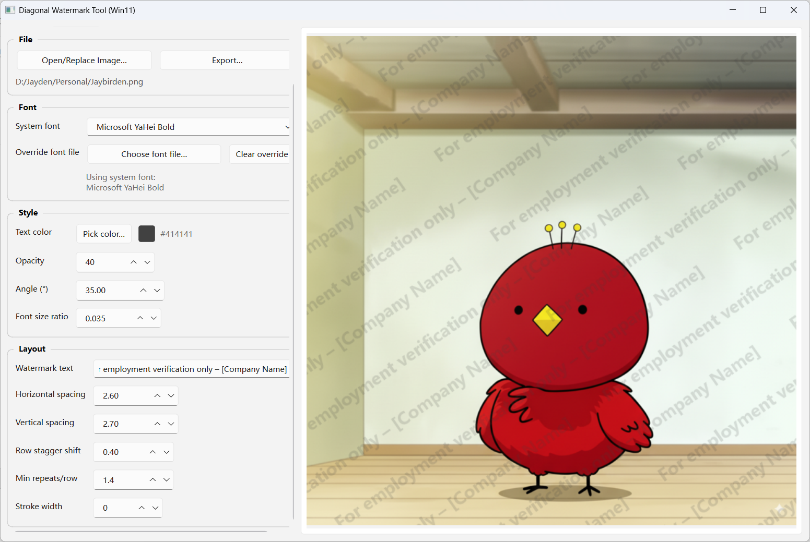

# 斜向水印工具（Win11 / PySide6）

[English README →](README.en.md)

一个用于给图片添加**斜向重复文字水印**的小工具：左侧调整参数（可滚动），右侧实时预览（自动缩放，整图可见），支持中英文 UI、系统字体选择与字体文件覆盖。



---

## 功能特性

- 斜向重复水印：角度、间距、行交错、每行最少重复可调
- 外观可调：文字颜色、不透明度、字号比例、描边宽度
- 字体支持：
  - Windows 系统字体下拉（支持搜索）
  - 可选择 `.ttf / .ttc / .otf` 字体文件覆盖（优先级最高）
- 导出：PNG / JPEG / BMP / WEBP
- 预览：自动防抖刷新（约 180ms），预览区域自动等比缩放以保证整图可见

---

## 目录结构

```
 ├─ app.py
 ├─ watermark_core.py
 ├─ requirements.txt
 └─ assets/
 └─ UI.png
```


## 环境要求

- Windows 10/11（**系统字体枚举依赖 Windows 注册表**；非 Windows 仍可运行，但系统字体列表可能为空，会走内置兜底字体）
- Python 3.10+（推荐 3.11）
- 依赖见 `requirements.txt`：`pillow`, `pyside6`, `pyinstaller`


## 安装与运行（Conda）

```bash
conda create -n diagonal-watermark python=3.11 -y
conda activate diagonal-watermark
pip install -r requirements.txt
python app.py
```

------

## 安装与运行（Python venv）

**Windows（PowerShell / CMD）：**

```
py -m venv .venv
.\.venv\Scripts\activate
pip install -r requirements.txt
python app.py
```

> 如遇到 PowerShell 执行策略问题，可用管理员打开 PowerShell 后执行：`Set-ExecutionPolicy RemoteSigned`（或改用 CMD）。

------

## 使用说明（操作流程）

1. 运行程序：`python app.py`
2. 点击 **“选择/替换图片…”**，选择需要加水印的图片
3. 按需调整左侧参数（会自动更新右侧预览）：
   - **语言**：切换中/英文 UI（若水印文字仍是默认文案，会随语言切换默认内容）
   - **系统字体**：下拉选择/输入关键字搜索
   - **字体文件覆盖**：选择字体文件后将优先生效；“清除覆盖”恢复使用系统字体
   - **文字颜色 / 不透明度**：控制颜色与透明度（0–255）
   - **倾斜角度 / 字号比例**
   - **水平/垂直间距系数**：数值越大，水印越稀疏
   - **行交错位移**：让相邻行产生错位，减少“对齐感”
   - **每行至少重复**：用于控制每行至少出现多少次水印（工具会自动限制水平间距以满足这个下限）
   - **描边宽度**：增强可读性（0 表示无描边）
4. 点击 **“导出结果…”** 选择保存路径与格式

------

## 打包

> `requirements.txt` 已包含 `pyinstaller`

```
pyinstaller -F -w app.py
```

- `-F`：打成单文件
- `-w`：无控制台窗口（GUI 应用常用）

若你有自定义字体文件需要随包分发，可考虑把字体放到项目目录并在运行时选择覆盖字体文件。

------

## 常见问题

- **为什么非 Windows 看不到系统字体下拉内容？**
   项目使用 Windows 注册表枚举系统字体；非 Windows 会返回空列表并使用兜底字体。
- **导出 JPEG 颜色/透明度有变化？**
   JPEG 不支持 alpha 通道，导出时会自动转为 RGB。